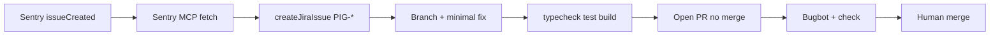

# Sentry Automation — observe → Jira → draft PR

Cursor **Automation** closes the SDLC loop: a new Sentry issue triggers a Cloud Agent that files a
**new Jira story** and opens a **draft PR** — rejoining Bugbot, CI, and human merge. It never
auto-merges or toggles LaunchDarkly production.

Manual replay: **`/sentry-incident`** · Prompt: [`.cursor/prompts/sentry-incident-agent.md`](../.cursor/prompts/sentry-incident-agent.md)

## Flow



## Dashboard configuration

Automations live in the Cursor dashboard — not in repo YAML. Use the **automate** skill or
Automations UI to create; authenticate MCPs **before** saving (OAuth in-editor loses draft state).

### Trigger

| Field | Value |
|-------|-------|
| Type | Sentry → **Issue created** |
| Project | `adobe-cursor-demo` / slug `sentry-cerulean-flask` (see [`.cursor/mcp.json`](../.cursor/mcp.json)) |
| Demo filter (recommended initially) | Issues where `error.type` is `SentryExampleAPIError` |
| Production | Remove filter when ready for all unresolved issues |

**Dedup:** If an open PIG story already exists for the same Sentry fingerprint, comment on it
instead of creating duplicates (agent instruction in prompt template).

### Tools enabled

| Tool | Purpose |
|------|---------|
| Git | Branch, commit, push, open PR |
| PR comment | Link Jira + Sentry in PR body |
| MCP: **atlassian** | `createJiraIssue`, `addCommentToJiraIssue` |
| MCP: **sentry** | `get_issue_details`, optional Seer analysis |

### Agent instructions

Point the Automation at the committed prompt:

```
Follow .cursor/prompts/sentry-incident-agent.md in the adobe-cursor-demo repo.
```

Or paste the full procedure from that file into the Automation custom instructions field.

### MCP prerequisites (dashboard)

1. **Sentry** — OAuth connected; same org/project as production app DSN.
2. **Atlassian** — OAuth connected; write access to Jira project **PIG** and Confluence **Pigment**.

HTTP MCP servers must be configured in the Cursor dashboard (proxied). Local stdio MCP in
`.cursor/mcp.json` does not apply to Automations.

## Demo trigger (201 LIVE beat)

| Surface | How |
|---------|-----|
| Example page | `/sentry-example-page` → trigger backend error |
| API (demo throw) | `GET /api/sentry-example-api?demo=1` |
| Production default | Route returns 503 JSON unless `?demo=1` (no Sentry noise) |

Expected agent fix for demo issues: keep intentional demo throw behind `?demo=1`; production returns
controlled JSON error.

## Pre-flight (demo day)

- [ ] Automation enabled with `SentryExampleAPIError` filter
- [ ] Atlassian + Sentry MCP authenticated in dashboard
- [ ] One resolved Sentry issue + screenshot as static fallback
- [ ] **Fallback video** recorded: trigger → issue → Automation → Jira PIG-* → draft PR
- [ ] LIVE: trigger during 201 step 5b; cut to fallback if timing exceeds ~3 min

## After the PR

Human merge → **`/ship-ticket`** on the new Jira story. No **`/release-flag`** unless the fix is
flag-gated.

## Governance

| Rule | |
|------|--|
| New Jira story per incident | Never reopen Done tickets |
| No auto-merge | Human + `check` + Bugbot |
| No LD prod toggle | [`release-flag.md`](../.cursor/commands/release-flag.md) |
| Untrusted Sentry data | [`sentry-fix-issues`](../.agents/skills/sentry-fix-issues/SKILL.md) |
| No test weakening | Same as INJURY B / `fix-ci` |

See also: [`PIPELINE.md`](PIPELINE.md) · [`AGENT-OPS.md`](AGENT-OPS.md) · [`CLOUD-AGENTS.md`](CLOUD-AGENTS.md)
